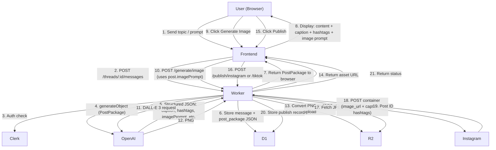
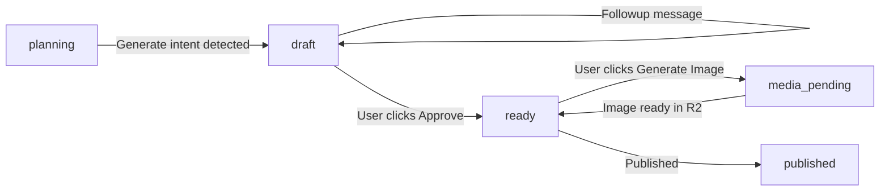
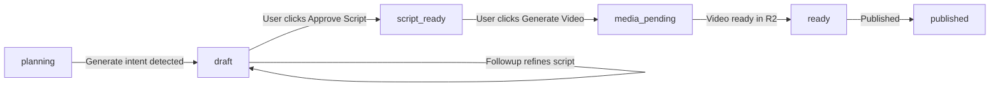
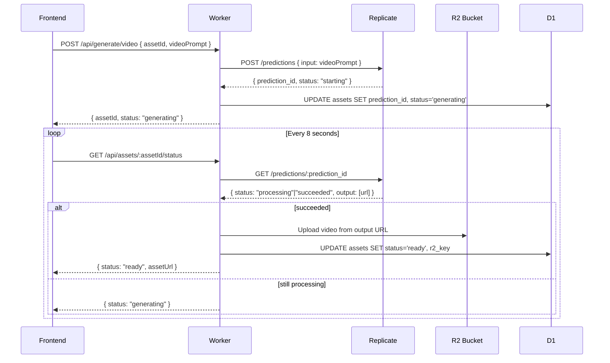
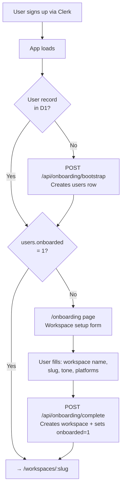

# ThreadForge MVP — Architecture Plan

## Stack

- **Frontend**: React + Vite + TypeScript → deploy to Cloudflare Pages
- **Backend**: Hono.js on Cloudflare Workers → `wrangler deploy`
- **Database**: Cloudflare D1 (SQLite) — native Workers binding, zero cold-start
- **File Storage**: Cloudflare R2 — for generated images and videos, S3-compatible
- **Auth**: Clerk (JWT middleware on Workers, hosted auth UI on frontend)
- **AI SDK**: Vercel AI SDK v6 (`ai` + `@ai-sdk/openai` + `@ai-sdk/react`) — works natively in Workers
- **AI — Text**: OpenAI GPT-4o via `streamText` (streamed directly as a Worker `Response`)
- **AI — Images**: OpenAI DALL-E 3 via `generateText` with image output, stored in R2
- **AI — Video**: Async via Replicate (prediction ID polling — no Durable Objects needed)
- **Social Publishing**: Instagram Graph API (live) + TikTok Content Posting API (live)

---

## Project Structure

```
thread-forge/
├── frontend/                  # React + Vite
│   ├── src/
│   │   ├── pages/             # /, /workspaces/:wid, /workspaces/:wid/threads/:tid, /workspaces/:wid/settings
│   │   ├── components/        # WorkspaceSwitcher, ChatThread, MessageBubble, AssetCard, PublishButton
│   │   ├── hooks/             # useWorkspace, useThread, useGenerate, usePublish
│   │   └── lib/               # api.ts (fetch wrapper), clerk.ts
│   ├── vite.config.ts
│   └── package.json
├── backend/                   # Hono.js on Workers
│   ├── src/
│   │   ├── routes/
│   │   │   ├── workspaces.ts  # CRUD + workspace-scoped sub-routes
│   │   │   ├── threads.ts     # /workspaces/:wid/threads
│   │   │   ├── messages.ts    # /workspaces/:wid/threads/:tid/messages
│   │   │   ├── generate.ts    # /workspaces/:wid/generate/image, /generate/video
│   │   │   ├── publish.ts     # /workspaces/:wid/publish/instagram, /tiktok
│   │   │   └── social.ts      # /workspaces/:wid/social/connect/:platform
│   │   ├── db/
│   │   │   ├── schema.sql     # D1 migration
│   │   │   └── queries.ts     # typed query helpers
│   │   ├── services/
│   │   │   ├── openai.ts      # text + image generation
│   │   │   ├── r2.ts          # asset upload/download
│   │   │   ├── instagram.ts   # Meta Graph API
│   │   │   └── tiktok.ts      # TikTok Content Posting API
│   │   ├── middleware/
│   │   │   └── auth.ts        # Clerk JWT verification
│   │   └── index.ts           # Hono app entry + bindings type
│   ├── wrangler.toml          # D1, R2, KV bindings + secrets
│   └── package.json
└── shared/
    └── types.ts               # Thread, Message, Asset, PublishRecord
```

---

## Data Flow



---

## Database Schema (D1)

```sql
-- schema.sql (7 tables)

-- Synced from Clerk on first login. Minimal — Clerk owns email/name/avatar.
CREATE TABLE users (
  id TEXT PRIMARY KEY,    -- Clerk user_id
  onboarded INTEGER DEFAULT 0,
  created_at INTEGER DEFAULT (unixepoch()),
  updated_at INTEGER DEFAULT (unixepoch())
);

-- A workspace = one brand/account. Each user can have many workspaces.
-- All integrations and content are scoped to a workspace, not a user.
CREATE TABLE workspaces (
  id TEXT PRIMARY KEY,
  owner_id TEXT NOT NULL REFERENCES users(id) ON DELETE CASCADE,
  name TEXT NOT NULL,
  slug TEXT UNIQUE NOT NULL,      -- URL-friendly: /workspaces/:slug
  avatar_url TEXT,                -- workspace logo
  -- AI preferences per workspace (each brand has its own voice)
  ai_tone TEXT DEFAULT 'professional'
    CHECK(ai_tone IN ('professional','casual','witty','formal','inspirational')),
  default_caption_style TEXT DEFAULT 'short'
    CHECK(default_caption_style IN ('short','medium','long')),
  default_platforms TEXT DEFAULT '["instagram"]',  -- JSON array
  created_at INTEGER DEFAULT (unixepoch()),
  updated_at INTEGER DEFAULT (unixepoch())
);

CREATE TABLE threads (
  id TEXT PRIMARY KEY,
  workspace_id TEXT NOT NULL REFERENCES workspaces(id) ON DELETE CASCADE,
  created_by TEXT NOT NULL REFERENCES users(id),  -- audit trail
  title TEXT,
  media_type TEXT NOT NULL DEFAULT 'undecided'
    CHECK(media_type IN ('undecided','image','video')),
  status TEXT NOT NULL DEFAULT 'planning'
    CHECK(status IN (
      'planning',      -- gathering idea, no output yet
      'draft',         -- PostPackage generated (image) OR script generated (video)
      'script_ready',  -- video path only: script approved, ready to generate video
      'media_pending', -- asset being generated (image or video)
      'ready',         -- all content + asset approved, publish unlocked
      'published'      -- published to at least one platform
    )),
  active_draft_id TEXT,  -- messages.id: current active PostPackage
  created_at INTEGER DEFAULT (unixepoch()),
  updated_at INTEGER DEFAULT (unixepoch())
);

CREATE TABLE messages (
  id TEXT PRIMARY KEY,
  thread_id TEXT NOT NULL REFERENCES threads(id) ON DELETE CASCADE,
  role TEXT NOT NULL CHECK(role IN ('user','assistant')),
  type TEXT NOT NULL DEFAULT 'chat'
    CHECK(type IN (
      'chat',     -- conversational message (planning phase)
      'draft',    -- first ImagePostPackage or VideoPostPackage
      'followup'  -- refined PostPackage
    )),
  content TEXT NOT NULL,
  post_package TEXT,  -- JSON: ImagePostPackage | VideoPostPackage
  created_at INTEGER DEFAULT (unixepoch())
);

CREATE TABLE assets (
  id TEXT PRIMARY KEY,
  thread_id TEXT NOT NULL REFERENCES threads(id) ON DELETE CASCADE,
  workspace_id TEXT NOT NULL REFERENCES workspaces(id),
  message_id TEXT REFERENCES messages(id),
  type TEXT NOT NULL CHECK(type IN ('image','video')),
  status TEXT NOT NULL DEFAULT 'pending'
    CHECK(status IN ('pending','generating','ready','failed')),
  r2_key TEXT,          -- null until generation completes (private path)
  public_url TEXT,      -- r2.dev public URL (used for TikTok PULL_FROM_URL)
  prompt TEXT,
  prediction_id TEXT,   -- Replicate prediction ID (video only)
  created_at INTEGER DEFAULT (unixepoch())
);

-- Social accounts belong to a workspace, not a user.
-- One workspace can connect one Instagram + one TikTok account.
CREATE TABLE social_accounts (
  id TEXT PRIMARY KEY,
  workspace_id TEXT NOT NULL REFERENCES workspaces(id) ON DELETE CASCADE,
  platform TEXT NOT NULL CHECK(platform IN ('instagram','tiktok')),
  access_token TEXT NOT NULL,
  refresh_token TEXT,              -- TikTok only; may rotate on each refresh
  account_id TEXT NOT NULL,        -- ig-user-id (Instagram) or open_id (TikTok)
  username TEXT,
  token_expires_at INTEGER,        -- refresh before this; 8h threshold for TikTok, 7d for Instagram
  refresh_token_expires_at INTEGER, -- TikTok: 365-day refresh token expiry
  connected_at INTEGER DEFAULT (unixepoch()),
  UNIQUE(workspace_id, platform)   -- one account per platform per workspace
);

CREATE TABLE publish_records (
  id TEXT PRIMARY KEY,
  workspace_id TEXT NOT NULL REFERENCES workspaces(id),
  asset_id TEXT REFERENCES assets(id),
  platform TEXT NOT NULL CHECK(platform IN ('instagram','tiktok')),
  platform_post_id TEXT,   -- final post ID after successful publish
  container_id TEXT,       -- Instagram creation_id or TikTok publish_id (polling)
  status TEXT NOT NULL DEFAULT 'pending'
    CHECK(status IN ('pending','processing','published','failed')),
  caption TEXT,
  hashtags TEXT,           -- JSON array
  error_message TEXT,
  created_at INTEGER DEFAULT (unixepoch())
);
```

---

## Reuse from `me-ten-backend`

These files are copied directly or minimally adapted:

| File | Action | Notes |
|---|---|---|
| `src/utils/Logger.ts` | Copy as-is | Slack + Bugsnag + throttled KV dedup — full observability layer |
| `src/middleware/rateLimiter.ts` | Copy as-is | KV-backed sliding window, generic factory |
| `src/routes/admin/db.ts` | Copy as-is | `/migrate`, `/schema`, `/tables`, `/query` admin panel |
| `src/migrations/index.ts` | Adapt | Use TypeScript migration runner (not raw .sql), replace table defs |
| `src/types.ts` | Adapt | Keep `JzResponse<T>` / `JzPaginatedResponse<T>` shape, rename prefix to `Tf` |
| `src/middleware/auth.ts` | Adapt | Replace OTP/JWT logic with Clerk JWT verification; keep three-tier (public/required/admin) structure |
| `wrangler.jsonc` | Adapt | Use `.jsonc` format (not `.toml`), replace bindings with ThreadForge names |
| `.dev.vars.example` | Adapt | Template for ThreadForge secrets |
| `.cursor/rules/` | Copy | Logging and base rules carry over unchanged |

**Patterns adopted from `me-ten-backend`:**
- Response shape: always `{ success: boolean, message?, data? }` — every route returns `TfResponse<T>`
- D1 access: raw `.prepare().bind().first()/.all()/.run()` — no ORM
- CORS: manual headers in `index.ts` global middleware (not `hono/cors`)
- Route structure: each group is its own `new Hono<{ Bindings: CloudflareBindings }>()`, mounted in `index.ts`
- Error handling: try/catch everywhere, `Logger.log()` in catch, generic message to client
- Migrations: TypeScript functions called via `GET /api/admin/db/migrate` (not a `.sql` file)
- KV key namespacing: `{entity}:{id}` pattern (e.g. `session:{userId}`, `ratelimit:{ip}:{window}`)

---

## Key Implementation Details

### Workers Bindings (`wrangler.jsonc`)

```jsonc
{
  "name": "thread-forge-backend",
  "main": "src/index.ts",
  "compatibility_date": "2025-01-01",
  "d1_databases": [{ "binding": "DB", "database_name": "threadforge", "database_id": "..." }],
  "r2_buckets": [{ "binding": "ASSETS", "bucket_name": "threadforge-assets" }],
  "kv_namespaces": [{ "binding": "KV", "id": "..." }],
  "vars": { "FRONTEND_URL": "https://threadforge.pages.dev" },
  "triggers": { "crons": ["0 */6 * * *"] },  // every 6h: covers Instagram (<7d) and TikTok (24h) token refresh
  // Secrets via wrangler secret put:
  // CLERK_SECRET_KEY, OPENAI_API_KEY, META_APP_ID, META_APP_SECRET
  // TIKTOK_APP_ID, TIKTOK_APP_SECRET, SLACK_WEBHOOK_URL
}
```

### Thread State Machine — Two Paths

A thread is a content project with two distinct paths depending on media type. The `threads.media_type` is set on first message (user declares it, or AI detects intent).

---

**Image Path**



**Video Path**



---

**What the AI generates at each state, per path:**

| Status | Image Path | Video Path |
|---|---|---|
| `planning` | `streamText` — conversational, gathers idea, asks about tone/platform | Same — also asks about duration, hook style |
| `draft` (first) | `generateObject → ImagePostPackage` | `generateObject → VideoPostPackage` (includes full script) |
| `draft` (followup) | `generateObject` with previous package as context, refines caption/hashtags/imagePrompt | `generateObject` refines script scenes, voiceover, CTA |
| `script_ready` | — | No AI call — script locked, Generate Video button enabled |
| `media_pending` | DALL-E 3 call (sync, ~10s) | Replicate/Runway call (async, poll) |
| `ready` | Publish buttons unlocked | Publish buttons unlocked |

---

**PostPackage schemas (two types, stored as JSON in `messages.post_package`):**

```typescript
// Image path — ImagePostPackage
const ImagePostPackageSchema = z.object({
  content: z.string(),                    // long-form idea / body copy
  caption: z.string().max(2200),          // Instagram caption
  title: z.string().max(150),             // TikTok title
  description: z.string().max(2200),      // TikTok description
  hashtags: z.array(z.string()).max(30),
  imagePrompt: z.string(),                // ready-to-use DALL-E 3 prompt
  imageStyle: z.string(),                 // e.g. "flat illustration", "cinematic photo"
  tone: z.string(),
  suggestedPlatforms: z.array(z.enum(['instagram', 'tiktok'])),
});

// Video path — VideoPostPackage
const VideoPostPackageSchema = z.object({
  content: z.string(),                    // concept overview
  caption: z.string().max(2200),          // Instagram caption (for Reel)
  title: z.string().max(150),             // TikTok title
  description: z.string().max(2200),
  hashtags: z.array(z.string()).max(30),
  script: z.object({
    hook: z.string(),                     // first 3 seconds — what grabs attention
    body: z.string(),                     // main content / narration
    callToAction: z.string(),             // end card CTA
    estimatedDuration: z.string(),        // e.g. "45–60 seconds"
    voiceoverNotes: z.string(),           // pace, tone, energy level
    scenes: z.array(z.object({
      description: z.string(),            // visual: what's on screen
      voiceover: z.string(),              // what's said in this scene
      duration: z.string(),               // e.g. "5s"
    })),
  }),
  videoPrompt: z.string(),               // prompt for Replicate/Runway
  tone: z.string(),
  suggestedPlatforms: z.array(z.enum(['instagram', 'tiktok'])),
});
```

---

**Worker routing logic (`POST /api/threads/:id/messages`):**

```typescript
const thread = await db.getThread(threadId);
const history = await db.getMessages(threadId);
const activeDraft = history.find(m => m.id === thread.active_draft_id);

// 1. Still in planning — chat or trigger generation
if (thread.status === 'planning') {
  const { mediaType, wantsGeneration } = detectIntent(userMessage, history);
  if (!wantsGeneration) {
    return streamText({ messages: history, system: PLANNER_PROMPT }).toDataStreamResponse();
  }
  await db.updateThread(threadId, { media_type: mediaType }); // set 'image' or 'video'
}

// 2. Generate or refine PostPackage
if (['planning', 'draft'].includes(thread.status)) {
  const schema = thread.media_type === 'video' ? VideoPostPackageSchema : ImagePostPackageSchema;
  const isFollowup = thread.status === 'draft';

  const { object: post } = await generateObject({
    model: openai('gpt-4o'),
    schema,
    system: isFollowup ? REFINE_PROMPT : GENERATOR_PROMPT,
    prompt: isFollowup
      ? `Previous: ${JSON.stringify(activeDraft?.post_package)}\nRequest: ${userMessage}`
      : userMessage,
  });

  const msgType = isFollowup ? 'followup' : 'draft';
  const msg = await db.saveMessage({ threadId, role: 'assistant', type: msgType, post_package: post });
  await db.updateThread(threadId, { status: 'draft', active_draft_id: msg.id });
  return json({ success: true, data: { message: msg } });
}
```

---

**What the frontend renders per message type:**

| `type` | Rendered as |
|---|---|
| `chat` (user) | Right-aligned bubble |
| `chat` (assistant) | Left-aligned bubble — planning replies |
| `draft` | **Image:** PostPackage card — content body, editable caption, hashtag chips, image prompt, Generate Image button, Publish buttons. **Video:** Script card — hook/body/CTA/scene list, voiceover notes, Approve Script button |
| `followup` | Same card as `draft`, badged "Revised v{n}" — older followups collapse to one-line strip with "Restore" |

**Only `threads.active_draft_id` renders expanded.** All previous versions collapse to a one-line strip: `"Draft v2 — 'Make it more casual' → [Restore]"`

---

**Approve Script button (video path only):**
- Sets `threads.status = 'script_ready'`
- No new message created
- Unlocks "Generate Video" button in the active draft card
- Sending another followup message from `script_ready` reverts to `draft` (re-opens script for editing)

---

### Agent Architecture — Single Agent, Multi-Prompt

**Decision: Single agent with multiple specialized system prompts — not multi-agent.**

Here's the trade-off analysis:

| Approach | Latency | Cost | Complexity | Works in Workers? |
|---|---|---|---|---|
| Multi-agent (chained GPT calls) | High (2–4 calls per request) | 3–4x | High (coordination, state passing) | Risky (30s chain limit) |
| Single agent, one prompt | Low | Low | Low | Yes |
| **Single agent, multi-prompt** | Low | Low | Medium | **Yes — recommended** |

Multi-agent would genuinely help if tasks were parallel or required different models. Here they're sequential and one model (GPT-4o) handles all of them well. Multi-agent adds coordination overhead without benefit at this scale.

**The "multi-prompt, single model" pattern:**

Four specialized system prompts, same GPT-4o model, selected by the Worker based on thread state:

```typescript
// services/prompts.ts
export const PLANNER_PROMPT = `
  You are a social media content strategist. Your job is to understand the user's content goal.
  Ask clarifying questions about: target audience, tone, platform, key message.
  Do NOT generate captions or copy yet. Gather the brief first.
  When the user gives enough info or says "generate", respond with JSON: { "ready": true }.
`;

export const IMAGE_GENERATOR_PROMPT = `
  You are a social media content creator specializing in visual posts.
  Generate a complete ImagePostPackage using the user's brief.
  The imagePrompt must be detailed enough for DALL-E 3 to produce a publish-ready visual.
  Caption must be under 2200 chars. Max 30 hashtags.
`;

export const VIDEO_GENERATOR_PROMPT = `
  You are a short-form video scriptwriter for TikTok and Instagram Reels.
  Write scripts that hook in 3 seconds. Structure: hook → value → CTA.
  Each scene must have a visual description and voiceover line.
  Target 30–60 seconds unless user specifies otherwise.
`;

export const REFINE_PROMPT = `
  You are refining an existing content draft based on user feedback.
  Keep everything that is not mentioned. Only change what the user asks for.
  Return the full updated PostPackage — do not omit unchanged fields.
`;
```

**Worker routing (simplified):**

```typescript
const promptKey =
  thread.status === 'planning'                                  ? 'planning'
  : thread.status === 'draft' && thread.media_type === 'image'  ? 'followup_image'
  : thread.status === 'draft' && thread.media_type === 'video'  ? 'followup_video'
  : thread.media_type === 'image'                               ? 'draft_image'
  :                                                               'draft_video';
```

---

### System Prompt, Tools, and Context Per Step

Every AI call lives in `services/openai.ts`. The function signature:

```typescript
callAI(step: AIStep, thread: Thread, history: Message[], userMessage: string): Promise<Response>

type AIStep =
  | 'planning'
  | 'draft_image'
  | 'draft_video'
  | 'followup_image'
  | 'followup_video'
```

---

**Step 1 — Planning**

```
Status:     planning
AI call:    generateObject(PlannerSchema)   ← NOT streamText
```

`streamText` cannot reliably emit a structured "ready" signal mid-stream. Instead, every planning exchange uses `generateObject` with a thin schema — the `reply` field is shown as the chat bubble, and the Worker checks `ready` to decide whether to immediately chain into draft generation.

```typescript
// Schema
const PlannerSchema = z.object({
  reply: z.string(),                           // shown to user as the assistant chat bubble
  ready: z.boolean(),                          // true when AI has enough info to generate
  mediaType: z.enum(['image','video']).optional(), // set when ready=true
  question: z.object({                         // optional structured question with choices
    text: z.string(),                          // the question to ask
    options: z.array(z.object({
      id: z.string(),                          // value sent back when user picks this
      label: z.string(),                       // display text shown to user
    })),
    allowMultiple: z.boolean().default(false), // true for e.g. platform selection
  }).optional(),                               // null = free-text reply expected
});

systemPrompt: `
  You are a social media content strategist helping creators plan content.
  Your job is to understand what the user wants — not to write the content yet.

  Gather through natural conversation (one question at a time):
  - Topic or idea
  - Platform (Instagram, TikTok, or both)
  - Media type (image/poster OR video/reel)
  - Tone (professional, casual, witty, inspirational)
  - Target audience and key CTA

  Set ready=true ONLY when you have: topic + platform + mediaType + tone.
  Set ready=false and ask one follow-up if any of those are missing.
  NEVER write captions, hashtags, or scripts — only ask and confirm.

  When asking about platform, tone, or media type — always return a structured question
  with options so the user can tap instead of type. For open-ended questions (topic,
  audience) leave question=null and expect a free-text reply.

  Workspace: ${workspace.name}
  Tone: ${workspace.ai_tone}
  Caption style: ${workspace.default_caption_style}
  Default platforms: ${workspace.default_platforms}
`

context: [
  ...history.map(m => ({
    role: m.role,
    content: m.type === 'chat' ? m.content : '[draft generated]'  // collapse drafts in planning history
  })),
  { role: 'user', content: userMessage }
]

tools: none

output: generateObject(PlannerSchema)
  → save message { role:'assistant', type:'chat', content: result.reply }
  → if result.ready === true: immediately chain into draft_image or draft_video step
  → if result.ready === false: return result.reply to frontend as chat bubble
```

**Frontend rendering for planning phase:**

```tsx
// MessageBubble.tsx — handles both free-text and structured question replies
{message.question ? (
  <div className="question-card">
    <p>{message.question.text}</p>
    <div className="options">
      {message.question.options.map(opt => (
        <button
          key={opt.id}
          onClick={() => sendMessage(opt.label)}  // sends selected label as next message
          className="option-chip"
        >
          {opt.label}
        </button>
      ))}
    </div>
    {/* text input still visible below chips for "Other" answers */}
  </div>
) : (
  <p>{message.reply}</p>
)}
```

When the user taps an option chip, it sends `opt.label` as their next message (e.g. "TikTok") — identical to typing it. The AI receives it as a normal user message and continues the planning flow. This means the chips are purely a frontend rendering concern — the backend has no special handling for them.

**Example planning exchange with structured questions:**

```
AI → { reply: "What kind of content are you making?", question: {
         text: "Choose media type",
         options: [{ id: "image", label: "Image / Poster" }, { id: "video", label: "Video / Reel" }],
         allowMultiple: false
       }}

User taps "Video / Reel" → sends message: "Video / Reel"

AI → { reply: "Got it! Which platforms are you targeting?", question: {
         text: "Choose platforms",
         options: [{ id: "instagram", label: "Instagram" }, { id: "tiktok", label: "TikTok" }],
         allowMultiple: true
       }}

User taps both → sends message: "Instagram, TikTok"

AI → { reply: "What tone should this video have?", question: {
         text: "Choose tone",
         options: [
           { id: "professional", label: "Professional" },
           { id: "casual", label: "Casual" },
           { id: "witty", label: "Witty" },
           { id: "inspirational", label: "Inspirational" }
         ],
         allowMultiple: false
       }}

User taps "Casual" → ...

AI → { reply: "I have everything I need. Ready to generate your script!", ready: true, mediaType: "video" }
→ Worker immediately chains into draft_video step
```

---

**Step 2a — Draft: Image**

```
Status:     planning → draft (first time)
AI call:    generateObject(ImagePostPackageSchema)
```

```typescript
systemPrompt: `
  You are a social media content creator specialising in image posts and visual carousels.
  Based on the conversation brief below, generate a complete, publish-ready content package.

  Rules for caption:
  - Instagram: max 2200 chars, hook in first line (shown before "more"), end with CTA
  - Front-load the most important idea — don't bury it
  - No hollow phrases like "In today's fast-paced world"

  Rules for hashtags:
  - Max 30, mix of broad (1M+), niche (10k–500k), and branded
  - Return without the # symbol (added on publish)

  Rules for imagePrompt:
  - Write as if briefing a professional photographer/illustrator
  - Include: subject, composition, lighting, colour palette, style, mood
  - Avoid: text in image, faces (unless requested), copyrighted styles
  - Example: "Flat lay of artisan coffee tools on warm oak wood, natural side lighting,
    earthy tones (amber, cream, forest green), minimal and editorial style, high contrast"

  Workspace: ${workspace.name}
  Tone: ${workspace.ai_tone}
  Platform targets: ${detectedPlatforms ?? workspace.default_platforms}
`

context: [
  // Full conversation history — the brief is embedded here
  ...history.map(m => ({ role: m.role, content: m.content })),
  { role: 'user', content: userMessage }
]

tools: none

output: generateObject(ImagePostPackageSchema) → stored in messages.post_package
```

---

**Step 2b — Draft: Video Script**

```
Status:     planning → draft (first time)
AI call:    generateObject(VideoPostPackageSchema)
```

```typescript
systemPrompt: `
  You are a short-form video scriptwriter for TikTok and Instagram Reels.
  Based on the conversation brief, generate a complete video content package with a detailed script.

  Script structure rules:
  - Hook (0–3s): must stop the scroll — ask a question, show a surprising visual, make a bold claim
  - Body: deliver the value promised in the hook — no filler
  - CTA (last 3s): one clear action ("Follow for more", "Link in bio", "Comment your answer")

  Scene rules:
  - Each scene: max 5–8 seconds
  - Voiceover must match visual — don't describe what's on screen, add to it
  - Write voiceover as natural spoken language, not formal prose
  - estimatedDuration should be honest — 30–60s is ideal for Reels/TikTok

  videoPrompt rules (for Replicate/Runway):
  - Synthesise all scenes into one cinematic prompt
  - Include: visual style, camera movement, colour grade, pacing, mood
  - Example: "Fast-cut lifestyle montage, handheld camera, warm golden-hour tones,
    upbeat energy, urban café setting, close-ups of coffee pour and hands typing"

  Workspace: ${workspace.name}
  Tone: ${workspace.ai_tone}
  Target duration: ${userSpecifiedDuration ?? '30–60 seconds'}
`

context: [
  ...history.map(m => ({ role: m.role, content: m.content })),
  { role: 'user', content: userMessage }
]

tools: none

output: generateObject(VideoPostPackageSchema) → stored in messages.post_package
```

---

**Step 3a — Followup: Refine Image Package**

```
Status:     draft (image) → draft
AI call:    generateObject(ImagePostPackageSchema)
```

```typescript
systemPrompt: `
  You are refining an existing social media content package based on user feedback.

  CRITICAL rules:
  - Return the FULL PostPackage object — never omit fields even if unchanged
  - Only modify fields that the user explicitly mentions or that logically must change
  - If user says "make caption more casual" — change caption and tone; keep hashtags and imagePrompt unchanged
  - If user says "change the image to show a beach" — update imagePrompt, imageStyle, possibly hashtags; keep caption unless it references the old image
  - Preserve the core message and CTA unless the user asks to change it
`

context: [
  // Full conversation history
  ...history.map(m => ({ role: m.role, content: m.content })),
  // Active draft injected as explicit context — not as a chat message
  {
    role: 'system',
    content: `CURRENT DRAFT (refine this):\n${JSON.stringify(activeDraft.post_package, null, 2)}`
  },
  { role: 'user', content: userMessage }
]

tools: none

output: generateObject(ImagePostPackageSchema) → new message with type='followup', becomes new active_draft_id
```

---

**Step 3b — Followup: Refine Video Script**

```
Status:     draft (video) → draft
AI call:    generateObject(VideoPostPackageSchema)
```

```typescript
systemPrompt: `
  You are refining an existing short-form video script based on user feedback.

  CRITICAL rules:
  - Return the FULL VideoPostPackage — never omit scenes or fields
  - If user says "make the hook stronger" — rewrite only script.hook; keep scenes, body, CTA
  - If user says "cut it to 30 seconds" — trim scenes proportionally, tighten voiceover, adjust estimatedDuration
  - If user says "change the tone to funny" — rewrite voiceover lines and hook; keep scene visuals
  - Always regenerate videoPrompt to reflect any script changes
`

context: [
  ...history.map(m => ({ role: m.role, content: m.content })),
  {
    role: 'system',
    content: `CURRENT SCRIPT (refine this):\n${JSON.stringify(activeDraft.post_package, null, 2)}`
  },
  { role: 'user', content: userMessage }
]

tools: none

output: generateObject(VideoPostPackageSchema) → new followup message
```

---

**Tools — MVP: none required. Post-MVP candidates:**

| Tool | When | Purpose |
|---|---|---|
| `searchHashtags(topic, platform)` | Planning / Draft | Pull live trending hashtags from a trends API |
| `getCompetitorInsights(topic)` | Planning | Inform tone/angle by seeing what's performing |
| `checkCaptionLength(caption, platform)` | Draft | Warn if approaching platform char limit |

Tools are not needed for MVP because `generateObject` with a well-constrained schema produces deterministic, correct-length output without needing external lookups. They become valuable when real-time trend data matters.

---

**Async video generation — the one place we DO need special handling:**

Video generation (Replicate/Runway) takes 2–10 minutes — far exceeding Workers' 30s limit. This is handled without Cloudflare Queues (overkill for MVP) using a **prediction ID polling pattern**:



No Durable Objects. No Queues. Each status-check is a fresh, fast Worker request (< 1s).

Image generation (DALL-E 3, ~10s) is fully synchronous — no polling needed.

---

### Vercel AI SDK — Why and How

**Workers compatibility:** `@ai-sdk/openai` uses native `fetch` internally — no Node.js APIs, no `http` module. It is explicitly edge-compatible and runs in the CF Workers V8 isolate without any shims. Cloudflare's own docs show `@ai-sdk/openai` being used with `createGatewayFetch` from `workers-ai-provider`, confirming first-class Workers support.

**Install:**
```bash
# backend (Workers)
npm install ai @ai-sdk/openai

# frontend (React browser)
npm install ai @ai-sdk/react
```

**Backend — `streamText` returns a native Worker `Response`:**
```typescript
import { streamText } from 'ai';
import { createOpenAI } from '@ai-sdk/openai';

const openai = createOpenAI({ apiKey: c.env.OPENAI_API_KEY });

const result = streamText({
  model: openai('gpt-4o'),
  messages,         // full thread history for context
  system: systemPrompt,
});
return result.toDataStreamResponse(); // standard Response — no Node.js, no buffering
```

**Frontend — dual approach (planning vs draft):**

Planning phase and draft/followup phases both return JSON (not streams), so the frontend uses a unified `fetch` wrapper with local React state rather than `useChat`:

```tsx
// hooks/useThread.ts
const [messages, setMessages] = useState<Message[]>([]);
const [isLoading, setIsLoading] = useState(false);

const sendMessage = async (content: string) => {
  setIsLoading(true);
  const res = await api.post(`/threads/${threadId}/messages`, { content });
  const { message, postPackage } = await res.json();
  setMessages(prev => [...prev, { role: 'user', content }, message]);
  if (postPackage) setActiveDraft(postPackage); // draft/followup
  setIsLoading(false);
};
```

`useChat` from `@ai-sdk/react` is **not used** — it is designed for streaming text responses and would require a dedicated streaming endpoint. All AI calls here return structured JSON objects, making a plain fetch pattern cleaner and fully type-safe.

**`generateObject` for a complete post package** — the AI produces everything needed to publish in one shot:

```typescript
import { generateObject } from 'ai';
import { z } from 'zod';

const PostPackageSchema = z.object({
  content: z.string(),                   // main body / long-form copy
  caption: z.string().max(2200),         // Instagram caption (2200 char limit)
  title: z.string().max(150),            // TikTok title (150 char limit)
  description: z.string().max(2200),     // TikTok description
  hashtags: z.array(z.string()).max(30), // works for both platforms
  imagePrompt: z.string(),               // ready-to-use DALL-E 3 prompt
  videoPrompt: z.string().optional(),    // Runway/Replicate prompt if needed
  tone: z.string(),                      // detected or applied tone
  suggestedPlatforms: z.array(z.enum(['instagram', 'tiktok'])),
});

const { object: post } = await generateObject({
  model: openai('gpt-4o'),
  schema: PostPackageSchema,
  system: SYSTEM_PROMPT,   // includes user's preferred tone from users.ai_tone
  prompt: userMessage,
});
// → post.caption, post.hashtags, post.imagePrompt are all ready to use immediately
```

The `messages` table stores the full `PostPackageSchema` object as a JSON column alongside the raw content, so the frontend can render each field separately and prefill the publish form.

**Important**: DALL-E 3 image generation (~8-15s) is well within the 30s Workers CPU limit. Video generation (if added later) exceeds this and would need Cloudflare Queues or Durable Objects.

### Instagram Publishing — Full API Reference

**Hard requirements (pre-flight checklist):**
- Instagram **Business** account only (Creator accounts blocked from Reels publishing via API)
- Must be linked to a Facebook Page
- Meta Developer App (Business type), in **Live Mode** (not Development)
- `instagram_business_content_publish` permission approved via Meta app review — takes 4–6 weeks
- `instagram_business_basic` permission also required (prerequisite)

**API base URL:** `https://graph.instagram.com/v21.0` (current version, May 2026)

---

**OAuth Flow (5 steps, runs in `social.ts` route):**

```
1. GET /api/social/connect/instagram
   → redirect to: https://www.instagram.com/oauth/authorize
       ?client_id={META_APP_ID}
       &redirect_uri={BACKEND_URL}/api/social/callback/instagram
       &scope=instagram_business_basic,instagram_business_content_publish
       &response_type=code

2. GET /api/social/callback/instagram?code={code}
   → POST https://api.instagram.com/oauth/access_token
       (code → short-lived token, valid 1 hour)

3. GET https://graph.instagram.com/access_token
       ?grant_type=ig_exchange_token
       &client_secret={META_APP_SECRET}
       &access_token={short_lived_token}
   → long-lived token (60 days)

4. GET https://graph.instagram.com/me?fields=id,username&access_token={token}
   → get ig_user_id and username

5. INSERT INTO social_accounts (id, user_id, platform, access_token, account_id, username, token_expires_at)
```

**Token refresh (must happen before expiry — expired tokens cannot be refreshed):**
```
GET https://graph.instagram.com/refresh_access_token
    ?grant_type=ig_refresh_token
    &access_token={long_lived_token}
```
Store `token_expires_at` in `social_accounts`. Refresh when < 7 days remaining.
Use a **Cloudflare Cron Trigger** (`0 0 * * *` daily) to sweep `social_accounts` and refresh expiring tokens.

---

**Image Publishing (2 steps, synchronous):**

```
Step 1 — Create container:
POST https://graph.instagram.com/v21.0/{ig-user-id}/media
  { image_url: "https://...", caption: "...", media_type: "IMAGE" }
  → { id: "creation_id" }

Step 2 — Publish:
POST https://graph.instagram.com/v21.0/{ig-user-id}/media_publish
  { creation_id: "..." }
  → { id: "published_media_id" }
```

**Critical: Instagram only accepts JPEG — DALL-E 3 returns PNG.**
Solution: add `@cf-wasm/photon` (WASM image processing) to the Worker. When storing a DALL-E 3 image to R2, convert it to JPEG and store as `{id}.jpg`. Only the JPEG key is used for Instagram publishing. The PNG is discarded.

---

**Reels Publishing (3 steps — video must be publicly accessible):**

```
Step 1 — Create container:
POST /v21.0/{ig-user-id}/media
  { media_type: "REELS", video_url: "https://...", caption: "...", share_to_feed: true }
  → { id: "creation_id" }

Step 2 — Poll until FINISHED (asynchronous, ~30s–2min):
GET /v21.0/{creation_id}?fields=status_code
  → status_code: IN_PROGRESS | FINISHED | ERROR

Step 3 — Publish:
POST /v21.0/{ig-user-id}/media_publish
  { creation_id: "..." }
```

**Polling workaround for Workers 30s limit:**
- Step 1 runs immediately in the publish route (< 2s)
- Store `container_id` in `publish_records` with `status: 'processing'`
- Frontend polls `GET /api/publish/status/:recordId` every 8 seconds
- Each status-check request is a fresh Worker call that hits Instagram's status endpoint and auto-publishes on `FINISHED`

**Reels video specs (for Reels tab eligibility):**
- Format: MP4 or MOV, H.264 + AAC
- Aspect ratio: 9:16 (1080×1920 recommended)
- Duration: 5–90 seconds for Reels tab; up to 15 min technically accepted but shown as feed video
- File size: max 300 MB
- The video URL must be a public HTTPS URL — Instagram fetches it directly from R2

---

**Rate limits:** 25 published posts per 24-hour rolling window per account

**Error codes to handle:** `24` (bad format), `9007` (container not FINISHED), `36003` (rate limit)

---

### TikTok Publishing — Full API Reference

**API base URL:** `https://open.tiktokapis.com/v2/`
**OAuth URL:** `https://www.tiktok.com/v2/auth/authorize/`

**Hard requirements (pre-flight checklist):**
- TikTok Developer account + app at [developers.tiktok.com](https://developers.tiktok.com)
- Content Posting API product added to the app
- Scopes: `video.publish` (Direct Post — goes live), `video.upload` (Upload to inbox as draft)
- App audit required for public posts — ~1–2 weeks clean, up to 6 weeks for messy submissions
- Before audit: all posts are `SELF_ONLY` (private) — only 5 sandbox test accounts supported
- `PULL_FROM_URL` method: R2 bucket domain must be verified in TikTok Dev portal via DNS TXT record

**Key difference from Instagram:** Access tokens expire every **24 hours** (not 60 days). This is the single most common production failure.

---

**OAuth Flow:**

```
1. GET /api/social/connect/tiktok
   → redirect to: https://www.tiktok.com/v2/auth/authorize/
       ?client_key={TIKTOK_APP_ID}
       &scope=video.publish,video.upload
       &response_type=code
       &redirect_uri={BACKEND_URL}/api/social/callback/tiktok
       &state={csrf_token}

2. GET /api/social/callback/tiktok?code={code}
   → POST https://open.tiktokapis.com/v2/oauth/token/
       { client_key, client_secret, code, grant_type: "authorization_code", redirect_uri }
   → { access_token (24h), refresh_token (365d), open_id, scope }

3. Store in social_accounts:
   - account_id = open_id
   - access_token, refresh_token
   - token_expires_at = now + 86400s
   - refresh_token_expires_at = now + 31536000s
```

**Token refresh (mandatory, every 18–20 hours):**
```
POST https://open.tiktokapis.com/v2/oauth/token/
  { client_key, client_secret, grant_type: "refresh_token", refresh_token }
→ { access_token, refresh_token }   ← IMPORTANT: refresh_token may be a NEW value — always update stored value
```
The Cron Trigger (`0 */6 * * *`) sweeps `social_accounts` and refreshes TikTok tokens where `token_expires_at < now + 28800` (< 8 hours remaining). This ensures at least one cron run catches every token before expiry — a 2h buffer is too tight given 6h cron intervals.

---

**Video Publishing Flow (4 steps with PULL_FROM_URL):**

```
Step 1 — Query creator settings (required before every post):
GET https://open.tiktokapis.com/v2/post/publish/creator_info/query/
  Authorization: Bearer {access_token}
→ { privacy_level_options, max_video_post_duration_sec, comment_disabled, duet_disabled, stitch_disabled }

Step 2 — Initialize upload:
POST https://open.tiktokapis.com/v2/post/publish/video/init/
  {
    post_info: { title: "...", privacy_level: "PUBLIC_TO_EVERYONE", disable_duet: false },
    source_info: { source: "PULL_FROM_URL", video_url: "https://r2.yourdomain.com/..." }
  }
→ { publish_id }

Step 3 — Poll status:
GET https://open.tiktokapis.com/v2/post/publish/status/fetch/?publish_id={id}
→ status: PROCESSING_UPLOAD | PROCESSING_DOWNLOAD | PUBLISH_COMPLETE | FAILED

Step 4 — Store result:
UPDATE publish_records SET status='published', platform_post_id={publish_id} WHERE ...
```

Same polling workaround as Instagram: store `publish_id`, frontend polls `/api/publish/status/:recordId` every 8s.

**Video specs:**
- Format: MP4 (recommended), WebM, MOV
- Codec: H.264 (recommended), H.265, VP8, VP9
- Max resolution: 4096px
- Max duration: 10 minutes via API (users trimmed to their account's limit in TikTok app)
- Rate limit: 6 requests/minute per token

---

**Photo (Image Carousel) Publishing:**

```
POST https://open.tiktokapis.com/v2/post/publish/content/init/
  {
    post_info: { title: "...", description: "... #hashtag", privacy_level: "PUBLIC_TO_EVERYONE" },
    source_info: {
      source: "PULL_FROM_URL",
      photo_images: ["https://r2.yourdomain.com/image1.jpg"],
      photo_cover_index: 0
    },
    post_mode: "DIRECT_POST",
    media_type: "PHOTO"
  }
→ { publish_id }
```

**Photo specs:** JPEG or WebP, max 20MB per image, max 1080p (no PNG-to-JPEG conversion needed — TikTok accepts JPEG natively)

**R2 public access for PULL_FROM_URL:**
TikTok's `PULL_FROM_URL` requires a verified domain. R2 buckets are private by default.
- Enable R2 public access in Cloudflare dashboard → R2 → bucket → Settings → Public Access → enable `r2.dev` subdomain
- Verify the `*.r2.dev` domain (or specific bucket URL prefix) in TikTok developer portal under URL Properties
- All asset URLs stored in D1 use the format: `https://{account-hash}.r2.cloudflarestorage.com/{key}` (private, for Instagram) OR `https://pub-{hash}.r2.dev/{key}` (public, for TikTok PULL_FROM_URL)
- Store both in the `assets` table: `r2_key` (private path) and `public_url` (r2.dev public URL)

---

**Privacy levels:**
- `SELF_ONLY` — private (forced before audit approval)
- `PUBLIC_TO_EVERYONE` — public
- `MUTUAL_FOLLOW_FRIENDS` — followers only
- `FOLLOWER_OF_CREATOR` — followers only

Always read allowed values from `creator_info/query` — not all creators have all privacy options.

**Error codes to handle:** `access_token_invalid` (401 — token expired, trigger refresh), `spam_risk_too_many_posts` (rate limit), `privacy_level_option_mismatch` (use creator_info values)

### Clerk Setup (CLI-driven)

The frontend uses the Clerk CLI for initialization — linked to app `app_3GU3pYQq2rqhbH1kEKNALFfyLng`.

**Setup sequence (run from `frontend/`):**

```bash
# 1. Install CLI if not present
npm install -g clerk

# 2. Authenticate
clerk auth login

# 3. Init into the React+Vite project (auto-detects framework)
clerk init --app app_3GU3pYQq2rqhbH1kEKNALFfyLng

# 4. Verify
clerk doctor
```

`clerk init` installs `@clerk/react`, writes `VITE_CLERK_PUBLISHABLE_KEY` to `.env.local`, and wires up the provider. Since this is React + Vite (not Next.js), no proxy matcher is needed.

**Auth controls in the app shell:**

```tsx
import { SignInButton, SignUpButton, UserButton, SignedIn, SignedOut } from '@clerk/react'

<SignedOut>
  <SignInButton /> <SignUpButton />
</SignedOut>
<SignedIn>
  <UserButton />
</SignedIn>
```

If `components.json` exists (shadcn/ui), also run `npm install @clerk/ui` and apply the shadcn theme to `ClerkProvider`.

**Backend JWT verification:** the backend never calls Clerk's SDK for session management — it only verifies the JWT from the `Authorization: Bearer <token>` header using Clerk's JWKS endpoint. This is the adapted pattern from `me-ten-backend`'s three-tier middleware.

### Clerk Auth Middleware (adapted from `me-ten-backend` three-tier pattern)

```typescript
// backend/src/middleware/auth.ts

// Tier 1 — Required: 401 if no valid Clerk JWT
export const authMiddleware: MiddlewareHandler = async (c, next) => { ... };

// Tier 2 — Workspace guard: 403 if userId !== workspace.owner_id
// Applied to all /workspaces/:slug/* routes
export const workspaceMiddleware: MiddlewareHandler = async (c, next) => {
  const userId = c.get('userId');         // set by authMiddleware
  const slug = c.req.param('slug');
  const workspace = await db.getWorkspaceBySlug(c.env.DB, slug);
  if (!workspace || workspace.owner_id !== userId) return c.json({ success: false }, 403);
  c.set('workspace', workspace);          // available to all downstream handlers
  await next();
};

// Tier 3 — Admin: 403 if not in admin list (for /api/admin/* routes)
export const authAdminMiddleware: MiddlewareHandler = async (c, next) => { ... };
```

**Route mounting in `index.ts`:**
```typescript
// All workspace routes get both auth + workspace ownership check
app.use('/api/workspaces/:slug/*', authMiddleware, workspaceMiddleware);
app.route('/api/workspaces', workspaceRoutes);
```

---

## Onboarding Flow (first-time signup)

After Clerk signup, the user has no workspaces. The app must intercept every route and redirect to workspace setup until at least one workspace exists.



---

**Backend — two endpoints:**

```typescript
// POST /api/onboarding/bootstrap  (no workspace check — public auth)
// Called on every first load if user not in D1 yet
// Idempotent — safe to call multiple times
→ INSERT OR IGNORE INTO users (id, onboarded) VALUES (userId, 0)
→ returns { onboarded: boolean, workspaceSlug: string | null }

// POST /api/onboarding/complete  (requires auth, no workspace check)
// Body: { name, slug, ai_tone, default_caption_style, default_platforms }
→ INSERT INTO workspaces (...) 
→ UPDATE users SET onboarded=1 WHERE id=userId
→ returns { workspace }
```

Note: these two routes are the ONLY routes that bypass `workspaceMiddleware`. All other routes require a valid workspace.

---

**Frontend — route guard:**

```tsx
// App.tsx — runs after Clerk auth resolves
const { userId } = useAuth();

useEffect(() => {
  if (!userId) return;
  api.post('/onboarding/bootstrap').then(({ onboarded, workspaceSlug }) => {
    if (!onboarded) navigate('/onboarding');
    else if (location.pathname === '/') navigate(`/workspaces/${workspaceSlug}`);
  });
}, [userId]);
```

**`/onboarding` page — workspace setup form:**

- Workspace name (e.g. "My Coffee Shop")
- Slug (auto-generated from name, editable) — shown as `threadforge.app/workspaces/{slug}`
- AI tone selector: Professional / Casual / Witty / Formal / Inspirational
- Default platforms: Instagram / TikTok / Both (checkbox)
- Submit → `POST /api/onboarding/complete` → redirect to workspace

The form is minimal and fast — users should be in the app within 30 seconds of signing up.

---

## Frontend Pages

- `/onboarding` — First-time workspace setup (name, slug, tone, platforms). Blocked until complete.
- `/` — Redirects to first workspace if onboarded, `/onboarding` if not
- `/workspaces/:slug` — Thread list for this workspace + "New Thread" button + workspace switcher in nav
- `/workspaces/:slug/threads/:id` — Chat interface: message history + active draft card + publish buttons
- `/workspaces/:slug/settings` — Workspace settings: name, AI tone, connect Instagram/TikTok, danger zone

**Workspace switcher** lives in the top-left nav — shows current workspace name/avatar and a dropdown of all user's workspaces + "Create new workspace" at the bottom.

---

## Build Phases

1. Project scaffolding (monorepo, Hono backend, Vite frontend, wrangler.jsonc)
2. Database schema + D1 migration (7 tables)
3. Auth (Clerk CLI init, backend JWT middleware, ClerkProvider on frontend)
4. Onboarding flow (bootstrap + workspace setup page + route guard)
5. Workspace CRUD + switcher UI
6. Thread + Message CRUD (workspace-scoped)
7. AI generation — planning + draft + followup (GPT-4o, generateObject)
8. DALL-E 3 image generation + PNG→JPEG + R2 upload
9. Video generation — Replicate async + prediction ID polling
10. Instagram OAuth + image/Reels publishing + token refresh cron
11. TikTok OAuth + video/photo publishing + 24h token refresh cron
12. Frontend UI polish (onboarding, chat bubbles, draft cards, publish buttons, status badges)
